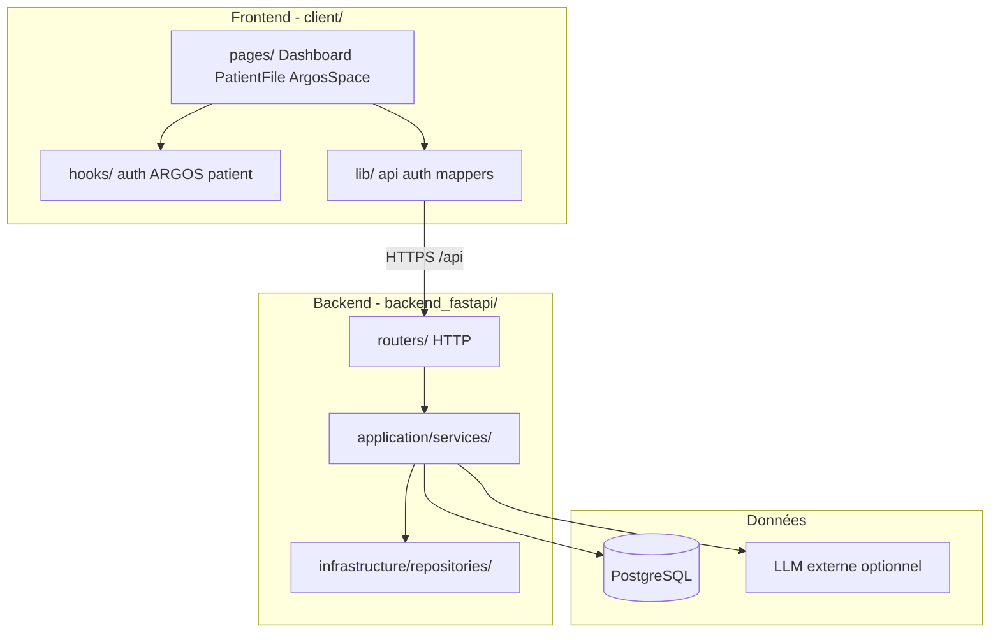

# Vue d'ensemble architecture ARCANE

Document de haut niveau pour comprendre **comment les pièces s'assemblent** sans lire tout le dépôt.

---

## Schéma global



---

## Backend — couches

| Couche | Rôle | Exemple |
|--------|------|---------|
| `routers/` | HTTP, validation Pydantic, codes statut | `argos.py`, `patients.py` |
| `application/services/` | Orchestration métier | `ArgosService.create_discussion` |
| `application/ports/` | Interfaces (tests, swap impl) | `ArgosRepositoryPort` |
| `application/use_cases/` | Cas d'usage fins | `StreamLlmSseUseCase` |
| `domain/` | Règles pures sans I/O | `login_throttle` |
| `infrastructure/` | SQL, JWT, clients LLM | `SqlArgosRepository` |
| `deps.py` | Composition / injection | `get_argos_service` |

**Règle** : les routeurs ne contiennent pas de SQL direct.

---

## Frontend — organisation

| Dossier | Rôle |
|---------|------|
| `pages/` | Écrans routés (1 route ≈ 1 page) |
| `components/` | UI réutilisable (layout, argos, patient-clinical, patient-file) |
| `hooks/` | État et effets React réutilisables |
| `lib/` | Appels API, auth, transformation données (sans JSX) |

**Règle** : la logique métier lourde va dans `hooks/` ou `lib/`, pas dans des composants de 1000 lignes.

---

## Flux données clés

### 1. Authentification

```text
POST /api/auth/login
  → access token (JSON) + refresh cookie HttpOnly
Frontend stocke access en mémoire, user en localStorage
401 sur API → POST /api/auth/refresh → retry
```

### 2. Dossier patient

```text
GET /api/patients/:id          → identité
GET /api/patients/:id/clinical → bundle structuré (mesures, cancers…)
GET/PUT /api/patients/:id/profile → profil JSON éditable
Draft local (localStorage)     → brouillon non publié uniquement
```

### 3. ARGOS (état cible vs actuel)

**Cible (roadmap P0)** :

```text
POST /api/argos/discussions
POST /api/argos/discussions/:id/messages
GET  → rechargement page = même historique
```

**Actuel (gap)** : `useArgosHistory` persiste aussi dans `localStorage` → risque divergence.

### 4. IA (rapport + ARGOS)

```text
POST /api/ai/report/stream  → SSE JSON structuré
POST /api/ai/argos/respond  → réponse structurée
Provider : disabled | mock_json | openai_compatible
```

Le LLM n'est **jamais** appelé depuis le navigateur (clé API backend uniquement).

---

## Base de données — tables principales

| Domaine | Tables (indicatif) |
|---------|-------------------|
| Auth | `users`, `activity_logs` |
| Patients | `patients`, `patient_profiles`, assignations |
| Clinique | mesures, médicaments, chirurgies, cancers, prélèvements… |
| ARGOS | `argos_discussions`, `argos_messages` |

Schéma : migrations dans `backend_fastapi/alembic/versions/`.

---

## CI / qualité

```text
Push/PR → frontend (tsc, eslint, vitest, build)
        → backend (ruff, alembic, pytest, coverage)
        → e2e (playwright)
```

---

## Où approfondir

- Backend détaillé : `backend_fastapi/ARCHITECTURE_SOLID_DDD.md`
- Frontend conventions : [FRONTEND_GUIDE.md](FRONTEND_GUIDE.md)
- Backend conventions : [BACKEND_GUIDE.md](BACKEND_GUIDE.md)
